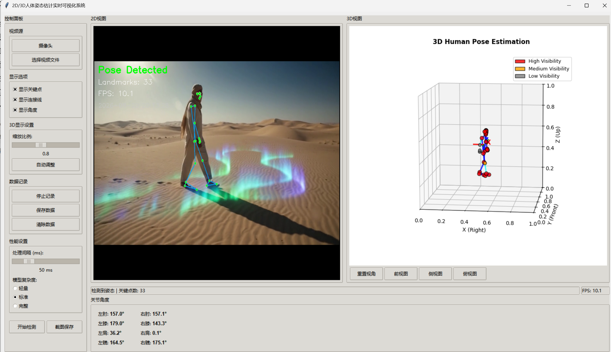
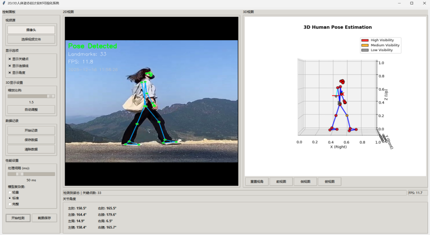
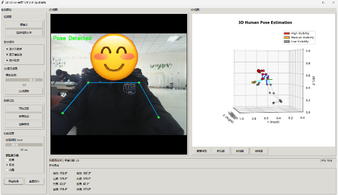

# Human Pose 2D/3D Visualizer

# 人体姿态 2D/3D 实时可视化系统

A real-time human pose estimation and visualization system based on MediaPipe Pose, OpenCV, Tkinter and Matplotlib.  

基于 MediaPipe Pose 的实时人体姿态估计与可视化系统，支持 2D/3D 骨架展示、关节角度计算与姿态数据记录。

## 📌 Overview / 项目简介

This project implements a complete 2D/3D human pose estimation pipeline using Python and MediaPipe Pose.  
It captures video from a webcam or local video file, detects 33 human keypoints in real time, and visualizes the skeleton in both 2D and 3D views.

本项目实现了一套完整的 2D/3D 人体姿态估计流程，基于 Python 与 MediaPipe Pose，支持摄像头或本地视频输入，实时检测 33 个关键关节点，并在 2D 与 3D 视图中同步展示人体骨架。

## Key Features / 核心功能

• ✅ Real-time pose estimation (2D + 3D)  

      实时姿态估计（2D / 3D）
• ✅ Webcam & local video input  

      摄像头与本地视频双输入
• ✅ 3D skeleton visualization with visibility-aware rendering  

      基于可见性的 3D 骨架渲染
• ✅ Joint angle calculation (elbows, knees, shoulders, hips)  

      关键关节角度实时计算（肘、膝、肩、髋）
• ✅ Adjustable model complexity (Lite / Standard / Full)  

      模型复杂度动态切换（轻量 / 标准 / 完整）
• ✅ Pose data recording and .pkl export  

      姿态数据记录与 .pkl 格式导出
• ✅ Cross-platform Chinese font support  

      跨平台中文字体适配
• ✅ One-click screenshot & multi-view 3D control  

      一键截图与 3D 多视角切换

### 🖼️ Demo / 效果展示

+-------------------+-------------------+
|     2D View       |     3D View       |
| (OpenCV + Tkinter)|  (Matplotlib 3D)  |
+-------------------+-------------------+

Example:
• 2D view: real-time skeleton overlay

• 3D view: rotatable human pose model

• Angle panel: real-time joint angles

## 🧠 Technical Highlights / 技术亮点

### 1. MediaPipe Coordinate Remapping

​	MediaPipe 坐标系重映射

​	MediaPipe uses a camera-centric coordinate system.  
​	This project remaps it into a visualization-friendly system:

​	Axis MediaPipe Visualization

​	X Right Right

​	Y Down Forward

​	Z Forward Up

​	MediaPipe 使用以摄像头为原点的坐标系，本项目将其转换为更适合可视化的 3D 坐标系，避免骨架“倒立”或方向混乱。

### 2. Visibility-Aware 3D Rendering

​	基于可见性的 3D 渲染优化

​	MediaPipe provides a visibility score for each landmark.  
​	The system dynamically adjusts point color and connection thickness:

​	Visibility Point Color Line Style

​	0.7 Red Thick Blue

​	0.3–0.7 Orange Cyan

​	< 0.3 Gray Thin Gray

​	通过可见性动态调整渲染样式，提升遮挡情况下的 3D 姿态可读性。

### 3. 3D Coordinate Normalization

​	3D 坐标标准化

​	To ensure stable visualization across different distances:
      1. Center using shoulder & hip landmarks  
      2. Scale by maximum joint distance  
      3. Translate to canvas center  

​	通过“中心化–缩放–平移”三步标准化，解决人物远近变化导致的骨架抖动与尺度不一致问题。

### 4. Performance-Aware Design

​	面向实时性能的帧率控制

​	Pose estimation runs only at configurable intervals instead of every frame.  
​	This allows smooth UI interaction even on low-end devices.

​	姿态检测按可配置间隔执行，而非逐帧推理，显著降低 CPU 占用，提升实时性。

### 5. Cross-Platform Chinese Font Support

​	跨平台中文字体适配

​	Automatically detects system-installed Chinese fonts on:
​	• Windows

​	• macOS

​	• Linux  

​	避免中文乱码，提升本地化体验。

## 🛠️ Installation / 安装说明

### Requirements / 环境依赖

• Python 3.8+

• OpenCV

• MediaPipe ≥ 0.10.9

• NumPy

• Matplotlib

• Pillow

### Install dependencies / 安装依赖

pip install opencv-python mediapipe numpy matplotlib pillow

## 🚀 Usage / 使用方式

Run the application / 启动程序

python human_pose_visualizer.py

Basic workflow / 基本操作流程

1. Start the application  
   启动程序
2. Click Start Detection  
   点击“开始检测”
3. Switch between Camera / Video File  
   切换摄像头或本地视频
4. Adjust 3D scale and viewing angle  
   调整 3D 缩放与视角
5. Record pose data or capture screenshots  
   记录姿态数据或截图保存

## 📂 Project Structure / 项目结构

human_pose_2d3d_gui.py   # Main application (single-file implementation)
README.md                  # Project documentation

This project is intentionally kept as a single-file implementation  

to reduce entry barriers for beginners and classroom use.  

为降低学习成本，本项目保持单文件结构，适合教学与课程作业展示。

### 🧪 Tested Environment / 测试环境

• OS: Windows 11

• CPU: Intel i5-12400

• RAM: 8 GB

• Python: 3.8

• MediaPipe: 0.10.9

Performance Summary / 性能表现

Model Complexity FPS CPU Usage

Lite (0) ~28 35–40%

Standard (1) ~18 50–55%

Full (2) ~10 70–75%

Standard model provides the best balance between accuracy and performance.  
标准模型在精度与性能之间取得了最佳平衡。

### 📖 Use Cases / 适用场景

• Computer vision coursework & labs  

  计算机视觉课程实验
• Sports motion analysis (angle measurement)  

  体育动作分析与角度评估
• Virtual human / avatar prototyping  

  虚拟形象驱动原型
• Low-cost motion capture research  

  低成本动作捕捉研究
• Educational demos for MediaPipe & Tkinter  

  MediaPipe 与 Tkinter 教学示例
